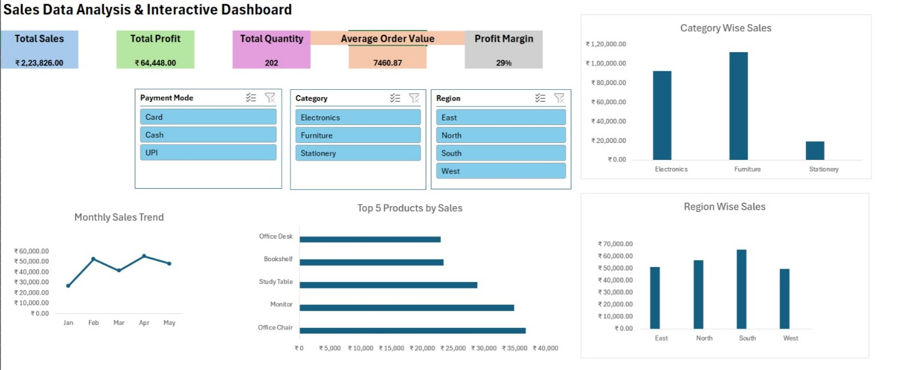

# Sales Data Analysis & Interactive Dashboard using Microsoft Excel

## Project Overview
This project analyzes sales data using Microsoft Excel to identify sales trends, patterns, and key business insights.

## Tools & Skills
- Microsoft Excel
- Data Cleaning
- Excel Functions
- Pivot Tables
- Charts
- Data Visualization
- Interactive Dashboard

## Project Work
- Analyzed sales data to identify trends and patterns.
- Used Excel functions and Pivot Tables for data analysis.
- Created charts to visualize sales performance.
- Developed an interactive dashboard to present key sales metrics and insights.

## Project File
The complete Excel project file is available here:

[Sales_Data_Project.xlsx](./Sales_Data_Project.xlsx)

## Dashboard Preview

